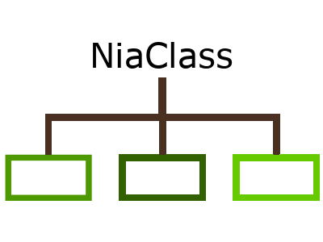

<p align="center"></p>

---

NiaClass is a framework for solving classification tasks using nature-inspired algorithms. The framework is written fully in Python. Its goal is to find the best possible set of classification rules for the input data using the <a href="https://github.com/NiaOrg/NiaPy">NiaPy framework</a>, which is a popular Python collection of nature-inspired algorithms. The NiaClass classifier support numerical and categorical features.

* **Free software:** MIT license,
* **Python versions:** 3.6.x, 3.7.x, 3.8.x, 3.9.x.

<p align="center"></p>

## Installation

### pip3

Install NiaClass with pip3:

```sh
pip3 install niaclass
```

In case you would like to try out the latest pre-release version of the framework, install it using:

```sh
pip3 install niaclass --pre
```

## Functionalities

- Binary classification,
- Multi-class classification,
- Support for numerical and categorical features.

## Examples

Usage examples can be found [here](examples).

## Reference Papers (software is based on ideas from):

[1] Iztok Fister Jr., Iztok Fister, Dušan Fister, Grega Vrbančič, Vili Podgorelec. [On the potential of the nature-inspired algorithms for pure binary classification](http://www.iztok-jr-fister.eu/static/publications/267.pdf). In. Computational science - ICCS 2020 : 20th International Conference, Proceedings. Part V. Cham: Springer, pp. 18-28. Lecture notes in computer science, 12141, 2020

## Licence

This package is distributed under the MIT License. This license can be found online at <http://www.opensource.org/licenses/MIT>.

## Disclaimer

This framework is provided as-is, and there are no guarantees that it fits your purposes or that it is bug-free. Use it at your own risk!
